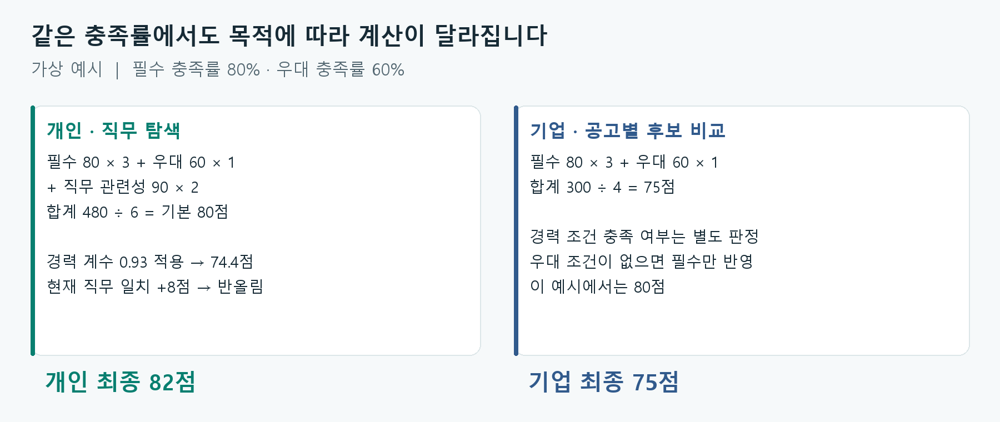

# 커리어 내비 · 적합도 계산 방식

## 계산 흐름 한눈에 보기

**경험에서 보유 역량을 찾고 → 직무·공고의 요구 역량과 비교하고 → 충족 정도를 점수로 계산해 → 살펴볼 직무나 후보를 정렬합니다.** AI는 경험을 읽고, 점수는 정해진 계산식으로 산출합니다.

| 단계 | 개인: 어떤 직무를 살펴볼까? | 기업: 어떤 후보를 검토할까? |
| --- | --- | --- |
| ① 입력 정리 | 이력서에서 보유 역량·경력·현재 직무 추출 | 후보의 등록된 보유 역량·경력 사용 |
| ② 요구사항 비교 | 각 직무의 필수·우대 역량과 비교 | 해당 공고의 필수·우대 역량과 비교 |
| ③ 점수 계산 | 필수·우대 충족률과 역량의 직무 관련성을 합산한 뒤 경력·현재 직무 반영 | 필수·우대 충족률을 3:1로 합산. 경력 조건은 별도 판정 |
| ④ 결과 제공 | 적합도 순으로 추천 경로 3개 구성. 조건을 충족하면 추가 탐색 경로 하나 포함 | 적합도 순으로 후보 정렬. 동점이면 경력 조건을 충족한 후보 우선 |

여기서 **충족률은 ‘가진 개수 ÷ 요구 개수’가 아닙니다.** 공고에서 자주 요구하는 역량에 더 큰 무게를 두고, 같은 대체 묶음은 하나의 영역으로 계산합니다. 예를 들어 요구 영역의 무게가 50·30·20이고 앞의 두 영역을 충족했다면 충족률은 **80%**입니다.

### 개인 점수는 이렇게 계산합니다

> **기본 점수 = (필수 충족률 × 3 + 우대 충족률 × 1 + 직무 관련성 × 2) ÷ 6**
>
> **최종 점수 = 기본 점수 × 경력 계수 + 현재 직무 일치 가산점** → 정수 반올림

위 식에서는 충족률과 직무 관련성을 각각 0~100으로 놓습니다. 직무 관련성은 **보유 역량이 다른 직무보다 이 직무에서 얼마나 두드러지게 요구되는지**를 나타냅니다. 경력이 부족하다고 판단되면 경력 계수로 감점하고, 현재 직무와 일치하면 총점 100점 이내에서 최대 8점을 더합니다.

**예시:** 필수 80, 우대 60, 직무 관련성 90 → 기본 **80점** → 경력 계수 0.93 적용 시 **74.4점** → 현재 직무와 일치하면 8점 추가 → 최종 **82점**입니다.

### 기업 점수는 이렇게 계산합니다

> **최종 점수 = (필수 충족률 × 3 + 우대 충족률 × 1) ÷ 4** → 정수 반올림

**예시:** 필수 80, 우대 60 → `(80 × 3 + 60) ÷ 4` = **75점**입니다. 공고에 우대 조건이 없으면 필수 충족률만 사용하므로 **80점**입니다. 경력이 공고 조건에 맞는지는 이 점수와 별도로 확인합니다.

숫자는 계산을 보여주기 위한 가상 예시입니다. 개인 점수는 **직무 탐색**, 기업 점수는 **공고별 후보 비교**를 위한 값이며 합격 확률을 뜻하지 않습니다. 아래에는 각 비율과 보정값을 구하는 방법, 추천 조건과 한계를 설명했습니다.

## 경험과 요구 역량을 어떻게 비교하는가

커리어 내비의 적합도는 사용자가 가진 역량과 직무 또는 채용공고의 요구사항이 얼마나 연결되는지를 비교하는 점수입니다. 개인에게는 다음으로 살펴볼 직무를 고르는 기준이 되고, 기업에는 공고에 맞는 후보를 검토하는 참고 정보가 됩니다. 점수가 높다고 취업이나 직무 전환의 성공을 보장하는 것은 아닙니다.

두 화면은 목적이 다르기 때문에 계산식도 다릅니다. 개인 추천은 직무의 요구사항과 함께 보유 역량의 특징, 경력, 현재 직무를 고려합니다. 기업 평가는 해당 공고에서 정한 필수·우대 역량의 충족 정도를 계산하고, 경력 조건 충족 여부를 별도로 보여줍니다. 따라서 개인 추천에서 받은 80점과 기업 공고에서 받은 80점을 같은 의미로 비교해서는 안 됩니다.

이 문서는 2026년 9월 13일의 구현을 기준으로 작성했습니다. 본문은 현재 사용되는 계산 흐름을 설명하고, 뒤에서는 추정값과 구현상 남아 있는 차이를 구분합니다.

## 1. 계산에 들어가기 전에 경험을 정리합니다

개인 분석은 이력서나 직접 입력한 경험에서 직무, 경력 개월 수, 역량 후보와 그 근거 문장을 추출하는 것으로 시작합니다. 코드는 등록된 역량 이름과 별칭을 원문에서 찾아 AI에 전달하고, AI는 문맥을 읽어 사용자의 경험에 해당하는 역량을 정리합니다.

반환된 근거 문장은 공백과 일부 문장부호 등을 정규화한 뒤 원문에 포함되는지 확인합니다. 원문에서 찾을 수 없는 근거는 제외합니다. 이는 근거 문장의 존재를 확인하는 절차이며, 그 경험의 수준이나 실제 수행 여부까지 검증하는 절차는 아닙니다.

역량 후보는 서비스의 표준 역량 ID로 연결합니다. 이름과 별칭을 정규화해 대조하고, 일치하지 않으면 부분 일치도 시도합니다. 연결되지 않은 후보는 점수 계산에서 제외하며, 같은 역량이 여러 번 나와도 한 번만 셉니다. 경력은 원문에서 연차나 근무 기간을 규칙으로 읽어 양의 개월 수를 얻으면 그 값을 우선하고, 그렇지 않으면 AI가 반환한 값을 사용합니다.

이후 점수는 AI가 아니라 코드가 계산합니다. 같은 표준 역량, 경력, 현재 직무와 같은 데이터가 주어지면 같은 점수와 추천 순서를 재현할 수 있습니다. 다만 원문을 해석하는 AI 단계의 결과까지 항상 같다고 보장하는 것은 아닙니다. `mock` 설정을 사용하거나 제공자와 API 키를 지정하지 않은 개발 환경에서는 별도의 규칙 기반 추출을 사용합니다.

기업 데모에서는 후보 데이터에 등록된 역량 ID와 경력 개월 수를 바로 사용합니다. 현재 기업 화면의 후보 평가는 실제 지원자의 이력서를 AI로 읽는 과정까지 연결된 상태는 아닙니다.

## 2. 먼저 비교할 요구 역량을 정합니다

### 개인 추천: 직무별 데이터에서 필수와 우대를 선택합니다

각 직무의 요구 역량은 직무·역량 행렬에서 가져옵니다. 이 데이터에는 채용공고에서의 등장 비율인 `weight`, 여러 자료를 종합한 중요도인 `importance`, 필수·우대 구분인 `tier` 등이 들어 있습니다.

필수와 우대를 고를 때 사용하는 강도는 다음과 같습니다.

> 요구 강도 = 중요도 × min(3, 직무별 변별력)

중요도는 `importance`를 우선하고, 값이 없으면 `evidence`, 그다음 `weight`를 사용합니다. 변별력인 `lift`는 해당 역량이 다른 직무에 비해 이 직무에서 얼마나 두드러지는지를 나타냅니다. 값이 없으면 1을 사용하고, 작은 표본에서 크게 튀는 값의 영향을 제한하기 위해 최대 3까지만 반영합니다.

요구사항을 고르는 순서는 다음과 같습니다.

1. 필수로 분류된 역량 중 강도가 해당 직무의 최고 강도 대비 40% 이상인 항목을 고릅니다. 사람이 필수로 지정한 항목은 이 강도 문턱을 적용하지 않습니다.
2. 이렇게 고른 필수가 3개 미만이면 강도 상위 3개로 목록을 다시 구성합니다. 원자료가 3개보다 적으면 있는 만큼만 사용합니다.
3. 사람이 지정한 항목을 우선해 필수를 최대 8개까지 남깁니다.
4. 나머지 중 우대로 분류되었거나 최고 강도의 20% 이상인 항목을 강도 순서로 최대 6개까지 우대로 선택합니다.

따라서 필수 역량은 모든 직무에서 같은 개수로 정해지지 않습니다. 다만 자료가 부족할 때 상위 항목으로 보완하는 규칙이 있으므로, 최종 필수 목록 전체를 ‘모든 채용공고에서 반드시 요구한 조건’이라고 해석해서는 안 됩니다.

### 기업 평가: 공고에 지정한 조건을 사용합니다

기업에서는 해당 공고의 필수·우대 역량 목록을 그대로 비교 기준으로 사용합니다. 새 공고에서도 작성자가 정한 조건으로 인재풀을 평가합니다. 다만 각 역량에 부여하는 무게는 공고별로 새로 학습하지 않고, 공고에 연결된 직무의 `weight`를 가져옵니다.

요구사항을 **목록에 넣는 기준**과, 목록 안에서 **점수에 얼마나 반영할지를 정하는 기준**은 다릅니다. 전자는 중요도와 필수·우대 구분 등을 참고하고, 후자는 채용공고의 등장 비율을 사용합니다.

## 3. 충족률은 개수보다 요구 비중을 반영합니다

필수 4개 중 2개를 갖췄다고 해서 언제나 충족률이 50%가 되지는 않습니다. 해당 직무에서 자주 요구하는 역량에 더 큰 무게를 두기 때문입니다.

> 충족률 = 충족한 요구 영역의 무게 합 ÷ 전체 요구 영역의 무게 합

이 계산을 필수와 우대에 각각 적용합니다. 요구 목록이 비어 있거나 전체 무게가 0이면 충족률은 0입니다. 데이터에 없는 직무·역량 조합의 무게도 0으로 처리합니다.

서로 대체 가능한 기술은 사전에 정한 묶음으로 다룹니다. 같은 묶음에 속한 요구사항은 필수 또는 우대 목록 안에서 하나의 영역으로 합치고, 그 안에서 가장 큰 무게를 영역의 무게로 사용합니다. 기술 이름이 여러 개 나열됐다는 이유만으로 점수가 중복해서 올라가지 않게 하기 위한 처리입니다.

예를 들어 한 기술 묶음의 요구 무게가 각각 0.6과 0.4이고, 별도 역량의 무게가 0.2라고 가정하겠습니다. 전체 무게는 1.2가 아니라 `0.6 + 0.2 = 0.8`입니다. 기술 묶음만 충족하면 충족률은 `0.6 ÷ 0.8 = 75%`입니다. 이 숫자는 계산을 설명하기 위한 가정이며 특정 직무의 실측값은 아닙니다.

### 대체 인정에도 직무별 조건이 있습니다

같은 묶음이라는 이유만으로 모든 대체를 허용하지는 않습니다. 직접 보유하지 않은 요구 역량을 대체하려면 같은 묶음의 다른 역량을 실제로 가지고 있어야 하고, 다음 조건도 만족해야 합니다.

> 보유한 대체 역량의 해당 직무 무게 ≥ 부족한 요구 역량 무게 × 0.5

같은 묶음의 역량을 여러 개 가지고 있다면 가장 큰 무게를 비교합니다. 예를 들어 부족한 역량의 무게가 0.8이라면 보유한 대체 역량의 무게가 0.4 이상이어야 대체가 인정됩니다. 무게가 0.2라면 인정하지 않습니다.

실제 영역 충족 판정은 묶음 안의 요구사항 중 하나라도 직접 보유했거나 대체 조건을 통과하면 성립합니다. 이때 영역 전체의 무게를 반영합니다. 따라서 이 규칙은 묶음 안의 모든 기술을 각각 능숙하게 사용할 수 있다는 판정과는 다릅니다. 묶음 자체도 사람이 정한 분류이므로 직무별 업무 차이를 계속 검토해야 합니다.

## 4. 개인 추천의 적합도를 계산합니다

개인 추천에는 필수 충족률, 우대 충족률, 보유 역량의 직무 관련성을 사용합니다. 이를 각각 M, N, S라고 하면 기본 점수는 다음과 같습니다. 세 값은 모두 0부터 1 사이입니다.

> 기본 점수 R = 100 × (3M + N + 2S) ÷ 6

필수 충족률에는 3, 우대에는 1, 보유 역량의 직무 관련성에는 2의 가중치를 둡니다. 이 비율은 현재 구현에서 정한 설계값이며 채용 성공률로 학습한 계수는 아닙니다. 개인 계산은 우대 목록이 비어도 분모 6을 유지합니다.

### 보유 역량이 어느 직무를 가리키는지도 봅니다

S는 단순한 보유 개수나 숙련도가 아닙니다. 한 역량의 직무별 요구 비율을 모두 더한 뒤, 그중 평가 대상 직무의 비율이 차지하는 몫을 계산합니다. 특정 직무에 수요가 집중된 역량은 그 직무에서 더 큰 값을 갖습니다. 공고 건수를 직접 합산한 비중이 아니라 **직무별 등장 비율을 합한 값에 대한 몫**입니다.

사용자가 가진 모든 표준 역량에 대해 이 몫을 구해 평균을 내고, 모든 직무 중 가장 높은 평균이 1이 되도록 나눕니다. 어느 직무에서도 관련성을 얻지 못하면 0입니다. 이 값은 같은 사용자의 역량이 어떤 직무를 더 강하게 가리키는지 비교하는 상대 지표입니다.

### 경력은 부족할 때 감점하는 방식으로 반영합니다

경력 계수 E는 직무별 신입 채용 비율과 사용자의 경력 개월 수로 계산합니다.

> 필요 경력 수준 = 1 − 신입 채용 비율
>
> 보유 경력 수준 = min(1, max(0, 경력 개월 수) ÷ 60)
>
> E = 1 − 0.35 × max(0, 필요 경력 수준 − 보유 경력 수준)

이 식에서 E는 0.65부터 1 사이입니다. 경력이 부족하다고 판단될 때 기본 점수를 줄이고, 60개월 이상이면 경력에 따른 감점을 하지 않습니다. 경력이 많다는 이유로 별도 가산점을 주지는 않습니다. 직무별 비율이나 경력 값이 없으면 이 계수는 1로 처리합니다.

현재 `newcomerRatio`는 사람이 입력한 추정값입니다. 실제 공고에서 측정한 신입 채용 비율이 아닙니다. 또한 여기서 사용하는 경력은 추출된 총경력이며, 전환하려는 직무에서의 경력을 따로 계산한 값이 아닙니다. 따라서 경력 계수는 직무별 실무 능력을 검증한 결과로 볼 수 없습니다.

### 현재 직무와 일치하면 최대 8점을 더합니다

현재 직무명을 표준 직무 ID로 연결했을 때 평가 대상 직무와 같으면 최대 8점을 더합니다. 총점이 100점을 넘지 않는 범위에서만 더하고, 마지막에 정수로 반올림합니다.

> 개인 적합도 = 반올림(R × E + 현재 직무 가산점)

예를 들어 M이 0.8, N이 0.6, S가 0.9이면 기본 점수는 80점입니다. 신입 채용 비율을 0.2, 경력을 36개월로 가정하면 E는 0.93이므로 경력 반영 후에는 74.4점이 됩니다. 현재 직무와 일치하면 8점을 더해 **82점**, 일치하지 않으면 **74점**입니다. 계산 과정을 설명하는 가상 예시입니다.

## 5. 점수와 추천 목록을 구분합니다

### 기본 순서는 적합도 순입니다

직무는 정수 적합도가 높은 순서로 정렬합니다. 동점이면 아래의 내부 근거 점수를 비교합니다.

> 내부 근거 점수 = R × E × 표본 계수 × 직무 구조 보정

이 값에는 현재 직무 가산점이 포함되지 않습니다. 표본 계수는 `min(1, √(공고 표본 수 ÷ 20))`으로, 표본이 20건 이상이면 1입니다. 이는 코드상 보정 계수이며 통계적 신뢰구간이나 예측 확률은 아닙니다.

직무 구조 보정은 여러 직무에 반복되는 필수 역량과 다른 직무의 요구사항에 포함되는 정도를 반영합니다. 역할의 범위가 넓은 직무가 여러 사용자의 추천을 지나치게 차지하는 문제를 줄이기 위한 보조 규칙입니다. 구체적인 산식은 부록에 정리했습니다.

표본과 직무 구조 보정은 표시용 적합도에 직접 곱하지 않습니다. 동점 처리, 추가 경로 선정, 근거가 약하다는 안내에 사용합니다. 내부 근거 점수가 30 미만이라고 일반 추천에서 제외하지는 않습니다.

경력 12개월 미만인 사용자는 신입 기준을 적용합니다. 이때 신입 채용 비율이 15% 미만인 직무를 추천 대상에서 제외하며, 비율이 없으면 제외하지 않습니다. 경력 값이 없을 때도 이 필터에서는 0개월로 취급합니다. 앞서 설명한 경력 감점과는 별도의 규칙입니다.

### ‘이 길도 있어요’는 조건을 통과한 경로에만 붙습니다

현재 직군과 다른 직군에서 연결할 근거가 있는 직무를 최대 하나 찾습니다. 먼저 표시용 적합도 45점 이상, 내부 근거 점수 25점 이상이어야 하며 현재 직무와도 달라야 합니다. 그다음 아래 순서로 판단합니다.

1. 해당 직무의 필수 역량 중 실제로 보유한 직군 간 공통 역량이 2개 이상인 경로를 우선합니다.
2. 그런 경로가 없으면 필수·우대를 합쳐 실제 보유한 직군 간 공통 역량이 3개 이상인 경로를 찾습니다. 이때 학습 난이도 0.3 이상인 역량만 셉니다.

직군 간 공통 역량은 직무·역량 행렬에서 2개 이상 직군에 연결된 역량입니다. 대체 인정만 받은 역량은 이 연결 근거 개수에 포함하지 않습니다. 후보가 여러 개면 연결 역량 수를 우선하고, 같으면 최초 전체 점수 1위 직무와 인접 관계가 있는 후보를 우선합니다. 인접 관계가 있다는 이유로 적합도 문턱을 낮추지는 않습니다.

여기서 찾지 못하면 개발자 설문의 기술·직무 분포를 보조 자료로 사용합니다. 설문에 연결되는 보유 기술이 2개 이상일 때, 각 기술 보유자의 직무 비중을 전체 응답자의 직무 비중과 비교한 배수의 기하평균을 구합니다. 이 값이 1.5 이상이면서 앞의 점수 조건도 통과하고, 기존 상위 3개와 현재 직무에 없는 직무를 찾습니다. 이 보조 경로는 같은 직군에서도 나올 수 있습니다. 설문에서 해당 기술과 직무의 조합이 없을 때는 계산을 위해 0.0005의 바닥값을 사용합니다.

이 설문은 기술 보유와 현재 직무의 관계를 보여줍니다. 해당 직무로 실제 전환한 이력이나 전환 성공률을 보여주는 자료는 아닙니다.

추가 경로를 찾으면 일반 상위 2개와 함께 최종 3개를 구성하고, 다시 적합도 순으로 정렬합니다. 찾지 못하면 일반 상위 3개를 사용합니다. 따라서 최종 추천은 항상 전체 점수 상위 3개와 같지는 않습니다. 어느 직무와도 연결 근거가 강하지 않을 때에는 낮은 점수와 그 한계를 안내합니다.

## 6. 기업에서는 공고의 역량 조건에 집중합니다

기업 후보 평가는 앞서 설명한 가중 충족률을 사용하되, 보유 역량의 직무 관련성 S와 개인용 경력 계수, 현재 직무 가산점은 넣지 않습니다.

> 우대 조건이 있는 공고: 적합도 = 반올림(100 × (3M + N) ÷ 4)
>
> 우대 조건이 없는 공고: 적합도 = 반올림(100 × M)

필수 충족률이 80%, 우대 충족률이 60%라면 75점입니다. 우대 조건 자체가 없는 공고에서 필수 충족률이 80%라면 80점입니다. 개인 계산과 달리 우대 조건이 없을 때 분모를 조정합니다.

경력은 공고의 최소·최대 개월 수 범위 안에 있는지를 별도로 판정합니다. 최대 경력이 지정되지 않았으면 상한은 적용하지 않습니다. 후보 목록은 적합도 순으로 정렬하고, 동점일 때 경력 조건을 충족하는 사람을 먼저 배치합니다. 경력 조건을 충족하지 못했다고 적합도 자체를 깎지는 않습니다.

기존 공고의 지원자와 새 공고의 인재풀 추천은 같은 평가 함수를 사용합니다. 지원 여부와 전형 상태는 점수에 가산되지 않습니다. 기존 지원자 목록은 해당 공고의 지원자에서, 인재풀 추천은 데모 후보 전체에서 후보를 가져온다는 차이가 있습니다. 화면의 필터는 계산된 후보 목록을 좁히는 기능입니다.

‘다른 직무’ 여부는 후보의 현재 직무 ID와 공고의 직무 ID가 다른지로 판단합니다. 같은 직군 안에서 직무가 달라도 이 표시에 해당할 수 있습니다.

## 7. 점수 옆의 정보는 별도로 해석해야 합니다

**부족 역량과 준비 기간.** 개인의 부족 역량은 필수 요구사항 중 직접 보유하거나 직무별 대체 조건으로 인정받지 못한 항목입니다. 그 학습 난이도를 합산해 1 이하면 ‘쉬움’, 2 이하면 ‘보통’, 그보다 크면 ‘도전적’으로 분류합니다. 예상 개월 수는 난이도 합에 3을 곱해 반올림하고, 부족 역량이 있으면 최소 1개월, 없으면 0개월입니다. 요약에는 부족 역량을 최대 3개만 싣지만 기간은 전체 부족 역량으로 계산합니다. 묶음 안의 미충족 항목도 이 단계에서는 각각 합산합니다.

기업의 온보딩 개월 수도 부족한 필수 역량의 난이도 합에 3을 곱하는 같은 형태의 추정식입니다. 두 기간 모두 실제 학습 시간이나 입사 후 적응 기간을 측정해 만든 예측값은 아닙니다. 사용자의 학습 환경과 경험 수준을 충분히 반영하지 못하므로 준비 규모를 가늠하는 참고값으로만 해석해야 합니다.

**경로의 의외성.** `surpriseScore`는 다른 직군이면 `40 + 0.6 × 적합도`, 같은 직군이면 `0.3 × 적합도`를 반올림합니다. 앞서 설명한 설문 보조 경로에는 같은 직군이어도 전자의 식을 적용하며 상한은 100입니다. 이 값으로 일반 추천 순위를 정하지는 않습니다.

**역량 지도와 숙련도.** 역량 지도의 분포 지표와 학습 난이도는 개인 적합도에 그대로 더해지지 않습니다. 학습 난이도는 추가 경로의 일부 조건과 준비 기간 추정 등에 사용합니다. 분석 결과의 `proficiency`는 현재 0.7로 고정되어 있으며, 실측 숙련도도 적합도 가중치도 아닙니다. 연봉과 직업 전망 역시 적합도 계산에 사용하지 않습니다.

**화면의 충족 개수.** 개인 결과의 기본 경로 카드에서는 숫자 점수를 숨기고 보유·부족 역량과 충족 개수를 보여줍니다. 적합도는 결과 데이터에 포함되어 추천 정렬에 사용됩니다. 요구사항 표의 충족 개수와 가중 충족률은 서로 다른 값입니다. 개수 비율만으로 개인 적합도를 다시 계산할 수는 없습니다.

## 8. 현재 구현에서 보완해야 할 부분

계산 규칙이 코드에 있다는 것은 결과를 추적할 수 있다는 뜻입니다. 그 규칙이 사람의 직무 적합성을 충분히 설명한다는 뜻은 아닙니다. 현재 제출 시 함께 밝혀야 할 한계는 다음과 같습니다.

- **추정값의 영향이 있습니다.** 경력 감점과 신입 필터는 수동으로 입력한 신입 채용 비율을 사용합니다. 일부 결과 문구가 이를 ‘신입 지원 가능 공고 비율’로 표현하지만, 현재는 실측 공고 비율로 제시할 수 없습니다. 학습 난이도와 예상 준비 기간에도 추정이 들어갑니다.
- **점수와 상세 표시의 대체 기준이 완전히 통일되지 않았습니다.** 가중 충족률은 직무별 50% 대체 문턱을 적용합니다. 반면 개인 결과의 요구사항별 `met` 표시와 일부 직무 상세, 기업의 부족 역량 목록은 같은 묶음의 역량을 가지고 있는지만 보는 경로가 남아 있습니다. 따라서 상세에서는 충족으로 보이지만 점수에서는 충분히 인정되지 않거나, 기업 온보딩 추정에서 부족 항목이 빠지는 차이가 생길 수 있습니다.
- **0인 무게는 점수로 구분하지 못합니다.** 공고에 지정한 역량이라도 직무 행렬의 무게가 0이면 해당 항목은 가중 충족률에 기여하지 않습니다. 요구 목록은 있으나 전체 무게가 0인 경우도 충족률이 0이 됩니다. 자료가 없다는 것과 능력이 없다는 것을 구분하는 보완이 필요합니다.
- **이력서에서 찾은 역량은 수행 수준까지 검증한 값이 아닙니다.** 같은 역량을 여러 번 적어도 하나로 처리하며, 근거 문장의 길이나 프로젝트 성과에 따른 숙련도 차등은 현재 점수에 반영하지 않습니다. 표준 역량을 찾는 부분 일치와 수동 대체 묶음도 오분류 가능성이 있습니다.
- **데이터와 평가의 범위가 제한됩니다.** 직무별 공고 표본이 고르지 않고 해외 자료가 포함됩니다. 기업 후보는 시연용 데이터입니다. 별도 평가 문서의 직무 일치율은 실제 합격률이나 전환 성공률이 아니며, 규칙 조정에 참고한 자료에서 얻은 결과를 독립적인 최종 검증 성능으로 제시하지 않습니다.

## 부록. 구현을 확인할 때의 기준

### 직무 구조 보정의 세부 계산

고유성은 각 필수 역량이 몇 개 직무의 필수 목록에 등장하는지 세고, 그 개수의 역수를 해당 직무의 필수 역량 전체에 대해 평균 낸 값입니다. 필수 항목 수를 n이라고 할 때 `(평균 × n + 0.5 × 3) ÷ (n + 3)`으로 0.5 방향으로 완화합니다. 필수가 없으면 0입니다. 이후 전체 직무의 최솟값과 최댓값으로 0~1 정규화하며, 둘이 같으면 0.5를 사용합니다. 이를 U라고 둡니다.

포함 정도는 해당 직무의 필수 역량 무게 중 다른 한 직무의 필수·우대 목록에도 들어 있는 무게의 비율입니다. 비교 대상 중 가장 큰 비율을 선택하고, 필수 항목이 있으면 위와 같은 방식으로 0.5 방향으로 완화합니다. 이를 C라고 둡니다. 이 비교는 역량 ID를 기준으로 하며 대체 묶음을 확장하지 않습니다.

보정의 원값은 `(0.6 + 0.4U) × (1 − 0.35C)`입니다. 마지막으로 전체 직무 중 가장 큰 원값으로 나눠 최고 보정값을 1로 맞춥니다. 이 보정은 내부 근거 점수에만 사용합니다.

### 주 화면과 별도로 남아 있는 계산 경로

기업 공유 이미지 API에는 `lib/matching.ts`의 별도 계산이 연결되어 있습니다. 이 경로는 역량 이름의 정확한 일치 **개수**로 필수·우대 충족률을 구하고, 3:1 가중치를 적용합니다. 우대가 없으면 필수만 사용하며, 공고 빈도에 따른 무게나 대체 묶음은 반영하지 않습니다. 기본 최소 적합도는 40점이고 동점이면 온보딩 추정 기간이 짧은 후보를 먼저 둡니다. 현재 기업 주 화면의 `lib/employer-index.ts`와 같은 계산으로 설명해서는 안 됩니다.

### 확인한 주요 파일

| 확인 내용 | 구현 또는 자료 |
| --- | --- |
| 개인 적합도·추천 선정·기간 추정 | [lib/scoring.ts](../../lib/scoring.ts) |
| 요구 역량·충족률·대체 인정·보정 | [lib/skill-index.ts](../../lib/skill-index.ts) |
| 기업 지원자·인재풀 평가 | [lib/employer-index.ts](../../lib/employer-index.ts) |
| 원문 추출·근거 확인·경력 보완 | [lib/llm.ts](../../lib/llm.ts), [lib/career.ts](../../lib/career.ts) |
| 분석 API와 입력 실패 처리 | [app/api/analyze/route.ts](../../app/api/analyze/route.ts) |
| 요구사항의 상세 표시 | [lib/job-detail.ts](../../lib/job-detail.ts), [components/RankingTable.tsx](../../components/RankingTable.tsx) |
| 신입 기준과 결과 자료형 | [types.ts](../../types.ts) |
| 별도 기업 공유 이미지 계산 | [lib/matching.ts](../../lib/matching.ts), [공유 이미지 API](../../app/api/og/employer/route.tsx) |
| 데이터 수집·평가 기록 | [DATA_COLLECTION.md](../DATA_COLLECTION.md), [RESUME_EVAL.md](../RESUME_EVAL.md) |

본문의 숫자 예시는 산식을 설명하기 위한 가정입니다. 이번 문서 작성에서는 소스의 실행 조건과 계산식을 대조했으며, 추천 성능을 새로 측정하거나 계산 로직을 변경하지 않았습니다.
