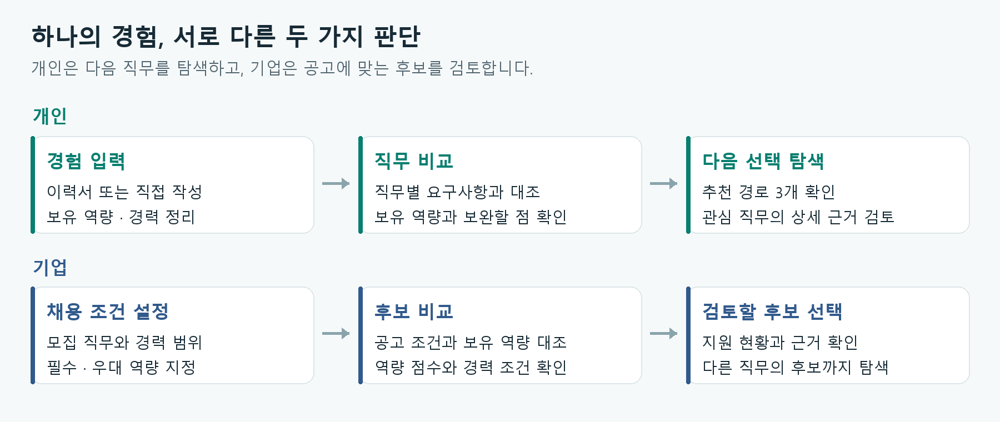

# 커리어 내비 · Career Navi

## 해온 경험에서 다음 커리어를 찾기까지

커리어 내비는 이력서에 담긴 경험과 채용공고에서 요구하는 역량을 비교해, 다음으로 살펴볼 직무와 준비할 내용을 안내하는 서비스입니다. 개인은 자신이 해온 일이 다른 직무에서 어떻게 쓰일 수 있는지 확인하고, 기업은 후보자의 경험이 채용 조건과 어떤 부분에서 연결되는지 검토할 수 있습니다.

아이디어를 처음 낸 사람은 대학을 갓 졸업하고 첫 취업을 준비하던 팀원입니다. 직업을 비교해볼 수 있는 서비스가 있으면 좋겠다는 제안이었습니다. 저는 당시 기존 경력을 바탕으로 다른 직무로 옮기는 일을 고민하고 있었고, 그 아이디어가 제 상황에도 도움이 될 것 같았습니다. 함께 공모전에 나가보자고 제안하면서 두 사람이 프로젝트를 시작하게 됐습니다.

## 서비스 흐름 한눈에 보기

개인은 자신의 경험을 바탕으로 다음 직무를 비교하고, 기업은 채용 조건을 바탕으로 후보를 비교합니다. 기업 흐름은 현재 가상 공고·후보를 사용하는 데모입니다.

## 1. 직업 비교 아이디어에 서로 다른 고민이 만났습니다

팀원과 저는 커리어의 서로 다른 시점에 있었습니다. 팀원은 대학을 졸업한 신입으로 취업을 준비하고 있었고, 저는 iOS 개발자로 일한 경력이 있는 상태에서 직무 전환을 고민하고 있었습니다. 직업을 비교하는 서비스를 만들어보자는 생각은 팀원이 먼저 제시했습니다. 저는 그 이야기를 듣고 참여했고, 이후 기획과 개발을 함께 진행했습니다.

제가 아이디어에 공감한 데에는 당시의 고민이 영향을 주었습니다. 다른 분야로 옮기려면 지금까지 쌓은 경험 중 무엇을 가져갈 수 있는지, 새로 익혀야 할 것은 무엇인지, 어느 정도 준비하면 지원을 고민해볼 수 있는지 궁금했습니다. 이런 질문은 프로젝트에 참여한 이유이자 서비스를 구체화하면서 살펴본 문제였습니다.

채용공고를 찾아보면 요구사항은 나옵니다. 다만 여러 공고를 열어 비교하고, 낯선 용어를 찾아보고, 자신의 경험과 하나씩 대조하는 일은 여전히 본인의 몫이었습니다. 같은 일을 가리키는 듯한 표현도 회사마다 달랐고, 어느 회사에만 필요한 조건인지 해당 직무에서 널리 요구하는 역량인지 구분하기도 어려웠습니다.

직무 이름만으로 경험을 설명하기 어렵다는 점도 눈에 들어왔습니다. 개발자라도 요구사항을 정리하고, 다른 팀과 우선순위를 조율하며, 사용자 반응을 보고 기능을 개선할 수 있습니다. 이런 경험은 다른 역할을 검토할 때도 참고할 만하지만, 이력서의 직함만 읽어서는 드러나지 않습니다.

직업을 비교한다는 처음 아이디어를 함께 구체화하면서, 해온 일을 읽고 그 경험이 어디에서 다시 쓰일 수 있는지도 보여주기로 했습니다. 직무를 추천받은 뒤에도 사용자가 근거를 확인하고 자신의 판단을 이어갈 수 있어야 한다고 생각했습니다.

## 2. 개인의 탐색과 기업의 검토를 나누어 설계했습니다

처음에는 이력서를 입력하면 세 가지 경로를 보여주고, 각 경로에서 부족한 역량과 준비를 시작할 방법을 확인하는 흐름에 집중했습니다. 두 사람이 제한된 기간 안에 완성해야 했기 때문에 회원가입이나 이력서 저장, 실제 채용 연동은 초기 범위에서 제외했습니다. 입력부터 결과 확인까지 한 번의 흐름을 제대로 만드는 것이 우선이었습니다.

개인 화면에서는 이력서 파일을 올리거나 경험을 직접 적을 수 있습니다. 분석 결과는 추천 경로, 내 역량, 다른 직무 탐색으로 나누었습니다. 추천 경로에서는 이미 보유한 역량과 보완할 내용을 먼저 확인하고, 관심 있는 직무를 펼쳐 자세한 근거를 읽을 수 있습니다. 추천 목록 밖의 직무도 직접 찾아 비교할 수 있도록 했습니다.

현재 직무와 다른 분야라도 경험을 연결할 근거가 있으면 ‘이 길도 있어요’라는 표시를 붙입니다. 모든 사용자에게 낯선 직무를 하나씩 제시하는 방식은 피했습니다. 입력한 경험에서 연결점을 찾기 어려운 경우에는 해당 표시가 나오지 않습니다.

기업 화면은 채용 담당자가 공고를 기준으로 사람을 검토하는 흐름입니다. 기존 공고의 지원 현황과 후보별 역량 근거를 확인하고, 필요하면 직무명이 다른 후보까지 살펴볼 수 있습니다. 새 공고를 작성할 때는 모집 조건과 필수·우대 역량을 정한 뒤 직접 내용을 쓰거나 AI 초안을 받아 수정할 수 있습니다.

공고에 실제로 지원한 사람과 인재풀에서 추천된 사람도 구분했습니다. 추천 인재에게 지원 의사가 있다고 가정할 수는 없기 때문입니다. 개인에게 필요한 것은 다음 선택지를 이해할 정보이고, 기업에게 필요한 것은 후보를 검토할 근거라는 차이를 화면에 반영했습니다.

## 3. 문장을 읽는 AI와 점수를 계산하는 코드를 구분했습니다

개발 초기에는 개인과 기업이 공통으로 사용할 직무·역량 데이터 구조부터 정했습니다. 어떤 정보를 주고받을지 먼저 맞춘 덕분에 데이터 작업과 화면 작업을 나누어 진행할 수 있었습니다.

직무별 요구 역량은 공개 채용공고를 수집해 만들었습니다. 자격요건과 우대사항을 구분하고, 어떤 역량이 얼마나 자주 등장하는지 집계했습니다. 직무 해설 자료와 O*NET·NCS 같은 직업·능력 분류 체계도 함께 참고했습니다. 공고에서 확인한 빈도와 다른 자료로 보강한 근거는 구분해 관리했습니다.

필수 역량을 직무마다 일정한 개수로 자르지는 않았습니다. 모든 직무에서 상위 다섯 개만 고르면 역할의 범위가 넓은 직무와 좁은 직무의 차이가 사라집니다. 공고가 필수와 우대를 어떻게 구분했는지, 여러 공고에서 얼마나 반복해서 요구했는지를 반영하려 했습니다.

사용자의 이력서를 읽는 과정에서는 AI를 활용합니다. 서술된 경험에서 직무와 역량 후보를 찾고, 이를 서비스에 등록된 역량과 연결합니다. 이후 점수와 순위는 코드에 정한 규칙으로 계산합니다. 같은 역량과 경력 정보가 들어왔을 때 계산 결과를 재현하고, 결과가 이상하면 어느 규칙에서 문제가 생겼는지 확인하기 위해서입니다. 다만 원문에서 정보를 추출하는 AI 단계에는 변동이 있을 수 있습니다.

점수는 보유 역량의 개수만으로 정하지 않습니다. 공고에서 요구하는 비중을 반영하고, 서로 대체할 수 있는 기술은 같은 묶음으로 다룹니다. 대신 어떤 직무에서는 대체 가능한 기술이 다른 직무에서도 그대로 인정되지 않도록 조건을 두었습니다. 기업 공고를 작성하는 AI 역시 문구 초안을 돕는 역할을 맡고, 역량 조건과 후보 매칭은 별도의 규칙으로 처리합니다.

## 4. 실제 이력서를 넣으면서 놓친 문제를 발견했습니다

화면에서 결과가 나온다고 해서 추천이 납득되는 것은 아니었습니다. 개발 중 가장 많은 판단이 필요했던 부분은 이상한 결과의 원인을 찾아 고치는 일이었습니다.

대표적인 사례는 직무 전환을 고민하던 저의 실제 이력서였습니다. iOS 개발 경력이 8년인 이력서를 넣었는데 임베디드·펌웨어 직무가 가장 먼저 추천됐습니다. 단순히 비슷한 기술을 사용한다는 이유만으로 설명하기에는 결과가 어색했습니다. 요구 역량을 살펴보니 표본이 적은 직무에서 일부 범용 기술의 영향이 크게 나타나고 있었습니다. 이후 표본이 적은 직무를 보수적으로 다루도록 보정했습니다. 다만 데이터 자체가 충분해진 것은 아니므로, 이 문제를 완전히 해결했다고 보지는 않습니다.

역량 이름을 찾는 과정에서도 오류가 있었습니다. ‘Unity’를 부분 문자열로 검색하면 ‘community’나 ‘opportunity’처럼 무관한 단어까지 잡힐 수 있었습니다. 이를 막기 위해 단어 경계를 확인하도록 바꾸고, 한국어 조사와 합성어도 따로 검토했습니다. 짧은 별칭은 특히 주의가 필요했습니다. ‘UI 자동화 테스트’의 UI를 디자인 역량으로 해석하던 사례에서는 실제 공고의 사용 문맥을 확인한 뒤 별칭을 제거했습니다.

경력 정보도 그대로 믿을 수 없었습니다. AI가 ‘8년차 iOS 개발자’라는 문장에서 경력을 0개월로 반환한 적이 있었습니다. 연차와 근무 기간처럼 명시적으로 확인할 수 있는 정보는 규칙으로 읽는 비중을 높였고, 여러 표기 방식과 겹치는 기간을 점검했습니다.

가진 기술을 다른 기술 대신 인정하는 규칙도 손봤습니다. Java 경험을 데이터 사이언티스트 직무의 Python 요구사항까지 채우는 근거로 사용하던 사례가 있었습니다. 같은 종류의 언어라는 이유만으로 대체를 허용하기에는 실제 업무 차이가 컸습니다. 해당 직무에서 그 기술이 차지하는 비중을 함께 확인하도록 조건을 조정했습니다.

이 과정에서 더 복잡한 방법이 항상 나은 결과를 주지는 않았습니다. 한국어 형태소 분석기를 도입하거나 직무를 더 세분화해 평가하는 방법도 시험했습니다. 일부 결과는 좋아졌지만 전체 순위가 나빠지는 경우가 있어, 적용하지 않거나 설명을 보완하는 용도로만 남겼습니다. 새로운 방법을 추가할 때마다 기존 결과와 비교한 이유입니다.

## 5. 무엇을 검증했고, 무엇이 아직 남아 있는지

추천 품질을 살펴보기 위해 개발자 설문 응답 3,420건을 이용한 평가를 구성했습니다. 응답자의 보유 기술을 넣었을 때 알려진 직무가 추천 목록에 나타나는지 확인하는 방식입니다. 화면 시연용으로 만든 가상 후보 데이터는 이 평가에 사용하지 않았습니다.

2026년 9월 11일에 기록한 평가에서는 알려진 직무가 1위로 나온 비율이 32.4%, 상위 세 개 안에 포함된 비율이 57.5%였습니다. 이 수치는 기술 정보를 바탕으로 기존 직무를 찾아내는 정도를 보여줍니다. 실제로 다른 직무로 옮길 수 있는지, 지원했을 때 합격할 수 있는지를 검증한 결과는 아닙니다. 또한 이 평가 자료를 규칙 조정에도 참고했으므로, 별도로 분리해 둔 최종 시험 집합의 성능으로 제시하지 않습니다.

이력서 형태의 입력도 따로 확인했습니다. 같은 날짜에 기록한 12개 사례에서는 1위 직무를 평가한 11개 사례와 경력을 평가한 12개 사례가 각각 기대 범위를 충족했습니다. 다만 이 테스트는 실제 AI 호출을 생략한 규칙 기반 추출을 사용합니다. 따라서 AI가 다양한 이력서 문장을 얼마나 잘 이해하는지까지 검증한 것으로 볼 수는 없습니다. 실제 입력을 통한 확인과 반복 가능한 테스트를 함께 보면서 오류를 찾아왔습니다.

현재 서비스는 24개 직무를 대상으로 합니다. 요구 역량을 만드는 데 사용한 채용공고는 1,435건이며, 해외 공고에 기반하고 있습니다. 국내 채용 시장의 표현과 요구를 충분히 반영했다고 보기 어렵고, 직무별 표본 수도 고르지 않습니다. 일부 직무에서는 적은 수의 공고나 보강 자료에 의존하는 비중이 큽니다. 준비 방법을 안내하는 문구에도 템플릿이 남아 있고, 학습 난이도에는 추정값이 사용됩니다.

기업과 지원 흐름은 가상 회사·공고·후보 데이터로 구현했습니다. 현재 데모에서 공고를 작성하거나 전형 상태를 바꾸어도 실제 채용으로 이어지거나 서버에 저장되지는 않습니다. 개인 이력서와 분석 결과도 애플리케이션 서버와 데이터베이스에 저장하지 않으며, 실제 AI 분석을 사용하는 경우 입력 내용이 해당 AI 제공자에게 전송된다는 점을 안내합니다.

## 6. 결과를 읽는 방식까지 고쳤습니다

기능을 연결한 뒤에는 다른 사람이 화면을 보고 어디를 눌러야 할지, 무엇을 읽어야 할지 알 수 있는지 확인했습니다. 추천 이유가 있더라도 긴 글 안에 묻혀 있으면 사용자가 이해하기 어려웠습니다. 화면 위쪽의 버튼을 버튼으로 알아보지 못하거나, 다른 내용이 있다는 사실 자체를 놓치는 피드백도 받았습니다.

개인 결과 화면에는 추천 경로, 내 역량, 다른 직무 탐색을 탭으로 배치했습니다. 경로를 펼치기 전에도 보유 역량과 보완할 내용을 볼 수 있게 하고, 상세 화면에서는 그 판단에 사용한 경험을 확인하도록 정리했습니다. 데모 입력은 사무직, 영업직, 개발자, 디자이너, 신입 사례 중 하나를 선택해 채우는 방식으로 바꾸었습니다. 처음 보는 사람도 입력에 오래 머무르지 않고 흐름을 살펴볼 수 있도록 하기 위해서입니다.

기업 화면은 처음 열었을 때 지원 인원이 보이지 않는다는 피드백을 반영했습니다. 상단 소개를 줄이고 전체 지원, 진행 중, 신규 지원, 면접 진행 인원을 먼저 배치했습니다. 채용 담당자가 현황을 파악한 뒤 필요한 후보를 골라 검토하는 순서에 맞춘 것입니다. 공고 작성도 모집 조건, 공고 내용, 검토 단계로 나누어 한 번에 읽고 입력해야 하는 양을 줄였습니다.

랜딩 이후 화면에서 글자와 로고가 작아 보이던 차이도 정리했습니다. 본문과 보조 정보의 크기를 조정하고, 공고 상세와 지원 준비 화면에서는 다음 행동으로 이어지는 버튼을 더 일찍 찾을 수 있게 했습니다. 개발 과정에서 다듬어야 할 대상에는 추천 로직뿐 아니라, 그 결과를 사람이 읽고 판단하는 화면도 포함돼 있었습니다.

## 7. 다음으로 확인하고 싶은 것

우선 국내 채용공고를 확보하고 표본이 적은 직무의 근거를 보완하려 합니다. 역할이 다른데 하나의 역량 이름으로 묶여 있는 경우를 구분하고, 부족한 역량에 대한 준비 안내도 실제 직무 맥락에 맞게 구체화할 필요가 있습니다.

추천이 사용자에게 도움이 됐는지도 확인해야 합니다. 처음 생각하지 못했던 직무를 살펴보게 됐는지, 그 이유가 납득됐는지, 준비할 내용을 정하는 데 도움이 됐는지를 실제 사용자에게 묻고 싶습니다. 기업에서는 직무명이 다른 후보의 경험을 검토할 때 근거 설명이 어떤 도움을 주는지 확인하려 합니다. 장기적으로는 실제 지원과 직무 이동 이후의 경험까지 살펴볼 필요가 있습니다.

제가 프로젝트에 참여할 때 궁금했던 ‘얼마나 준비해야 하는가’에는 아직 충분히 답하지 못했습니다. 학습 기간을 추정하려면 현재 역량뿐 아니라 학습 환경과 실제 준비 과정에 대한 자료가 필요합니다. 앞으로 모의면접이나 학습 안내로 확장하더라도, 먼저 부족한 부분을 더 정확하게 짚는 일부터 하려 합니다.

팀원이 제안한 직업 비교 아이디어에 제가 직무 전환을 고민하며 느낀 필요가 더해졌고, 두 사람이 함께 지금의 커리어 내비를 만들었습니다. 첫 취업을 준비하는 사람과 경력을 가지고 다음 일을 찾는 사람이 각자의 상황에서 직무를 비교하고 판단할 수 있도록, 앞으로도 실제 사용 경험을 보며 다듬어가려 합니다.

---

### 기록 및 작성 기준

이 문서는 프로젝트의 개발 기록인 `docs/STORYLINE.md`를 바탕으로 서비스 기획, 이력서 평가 기록, 미해결 과제와 이후의 화면 개선 내용을 함께 정리한 설명문입니다. 성능 수치는 `docs/RESUME_EVAL.md`의 2026년 9월 11일 기록을 인용했으며, 이번 문서 작성 과정에서 다시 측정한 값은 아닙니다. 기능 설명은 2026년 9월 13일의 구현 상태를 기준으로 작성했습니다.
